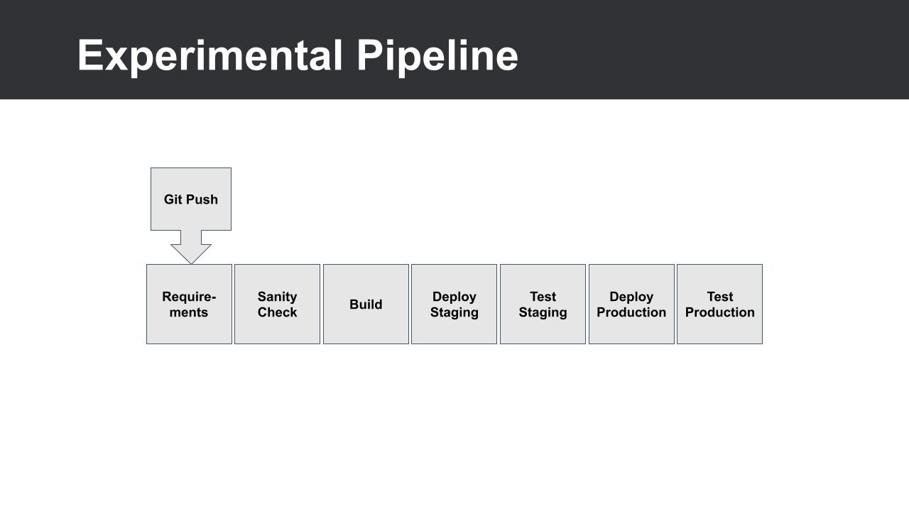

# 00_05 The Experimental Pipeline
As we explore CICD tools, it's helpful to have a sample pipeline to work with. We'll be configuring a pipeline that builds, tests, and deploys a web application. Our application is a Python script that serves JSON data over a simple API.

## Pipeline Stages
The pipeline will have seven stages.  Each stage must complete successfully for any following stages to be initiated.

1. **Requirements**: Install any tools or libraries needed to test, build, and deploy the application.

2. **Check**: Lint the code and run integration tests.

3. **Build**: Package the code into a deployable artifact.

4. **Deploy Staging**: Deploy the code to the staging environment.

5. **Test Staging**: Test the staging environment.  A successful test will allow the production deployment to proceed.

6. **Deploy Production**: Deploy the code to the production environment.

7. **Test Production**: Test the production environment to confirm the application has been deployed successfully.

## Your Pipeline Might Be Different
As you’re viewing this course, you might already have a pipeline in mind that you’re looking to implement.  Just know that all the stages mentioned here might not apply to your project.  But at the least, they should give you an idea of the stages in a typical CI/CD pipeline.

[Next: 00_06 About the Exercise Files](../00_06_about_the_exercise_files/README.md)
