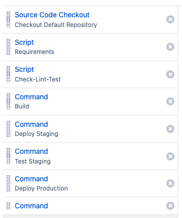
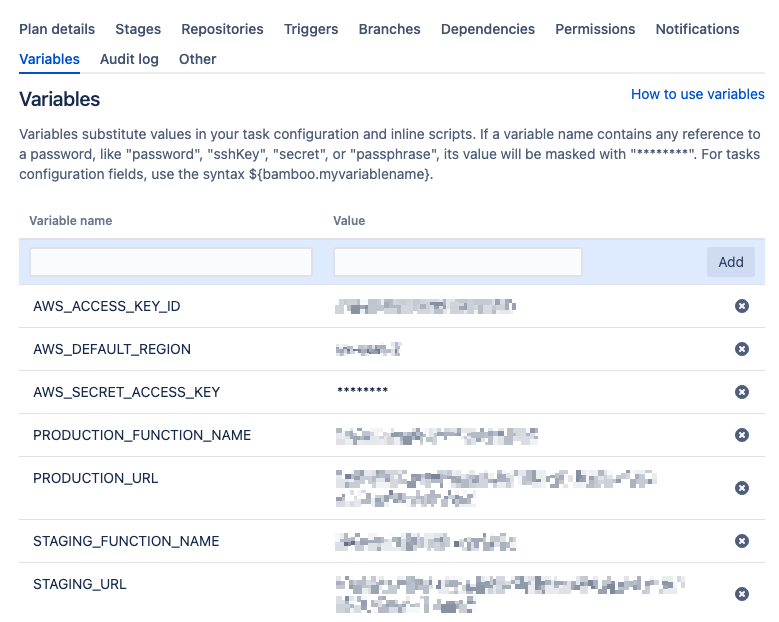

# 01_02 Bamboo
[Bamboo](https://www.atlassian.com/software/bamboo) is a self-hosted, continuous integration and delivery tool developed by Atlassian, the makers of popular software including Jira and Confluence among others.

## Reccommended Resources
TODO: In other makefiles, change "Reccommended Reading" to "Reccommended Resources"
- [Understanding the Bamboo CI Server](https://confluence.atlassian.com/bamboo/understanding-the-bamboo-ci-server-289277285.html)
- [Using Bamboo](https://confluence.atlassian.com/bamboo0903/using-bamboo-1236445012.html)
- [Bamboo FAQ](https://confluence.atlassian.com/bamboo0903/bamboo-faq-1236446400.html)
- [Configuring plans](https://confluence.atlassian.com/bamboo/configuring-plans-289276853.html)
- [Configuring tasks](https://confluence.atlassian.com/bamboo/configuring-tasks-289277036.html)
- [Configuring jobs](https://confluence.atlassian.com/bamboo/creating-a-plan-289276868.html)
- [Bamboo Specs (Configuration as Code)](https://docs.atlassian.com/bamboo-specs-docs/8.1.12/)

## Prequisites
Having the following items in place before starting this lab will help you have a smooth experience.

1. A [GitHub account](https://github.com/join) is required to host the code for the sample application.
1. An [Atlassian account](https://id.atlassian.com/signup) is required to request a license for the demo server.
2. An [Amazon Web Services account](https://aws.amazon.com/free) is needed to deploy and host the Bamboo server and the sample application used for the deployment target.
3. The sample application should be in place before starting.  See [00_06 About the Exercise Files](../../ch0_introduction/00_06_about_the_exercise_files/README.md) for steps to deploy the sample application.

## Deploy the Bamboo server
### 1. Create an AWS CloudFormation Stack using the provided template
1. Log into your AWS account.  Select the search bar at the top of the page and enter **CloudFormation**.
1. On the CloudFormation homepage, select **Create stack**.  If the button includes a dropdown, select **With new resources (standard)**.
1. Under "Prerequisite - Prepare template", confirm that "Template is ready" is selected.
1. Under "Specify template", select **Upload a template file**.  Select **Chose file**.  Browse to the exercise files for this lesson on your local system.  Select [`bamboo-cloudformation-template.yml`](./bamboo-cloudformation-template.yml).  Select **Open**. Select **Next**.
1. Enter a name for the stack under "Stack name"; `bamboo` is a good choice. *Note that the name should only include letters (A-Z and a-z), numbers (0-9), and dashes (-)*.  
1. Accept the defaults under "Parameters" and select **Next**.
1. On the "Configure stack options" screen, keep all options as the default.  Scroll to the bottom of the page and select **Next**.
1.  On the "Review" screen, scroll to the bottom of the page and select the **checkbox** next to "I acknowledge that AWS CloudFormation might create IAM resources with custom names".  Select **Submit**.
1. Review the "Events" tab on the stack homepage until *CREATE_COMPLETE* is reported under the "Status" column for the Logical ID that matches your stack name. *Note that it may take 5 to 10 minutes for the stack to report CREATE_COMPLETE*.
1.  On the stack homepage, select the "Outputs" column.  Open the value for the key "URL" in a new tab.

### 2. Configure the Bamboo server
To configure the Bamboo server, you need to create and enter an evalutation license, disable the embedded database check, and add a local agent.

#### 2.1 Create and enter an evaluation license
1. On the "Welcome to Bamboo Data Center", select **Generate a Bamboo Data Center license**. *Note that the text for this link is very small and located under the "License key" form.
2. If needed, log into your Atlassian account when prompted.
3. On the "New Trial License" page, confirm the product is "Bamboo" and the license type is "Bamboo (Data Center)".  Enter a value for "Organization" and select **Generate License**.
4. Highlight the value in the "License Key" field and copy it to your system clipboard.  Go back to the tab with the Bamboo setup wizard.
5. Paste the key into the "License key" form.  Select **Continue**.
6. On the "Configure instance" page, keep all the values as default, scroll to the bottom of the page and select **Continue**.
7. On the "Configure database" page, under "Database type", select **H2**. *Note that this option selects an embedded database which is for evaluation purposes and is not intended for production use*. Select **Continue**.
8. On the "Import data" page, confirm that "Create a new Bamboo home" is selected and select **Continue**.  Stand by for the database to be configured.
9. On the "Create admin" page, enter the details for your admin account and select **Finish**.  Stand by for the installation to complete.

#### 2.2 Disable notifications
This step prevents Bamboo from creating notificaitons about the server running with an embedded database or agents running on the primary server.

1. Once the installation is complete, select the cog on the top, far right of the page.  Select **Overview**.
2. Scroll to the bottom of that page and select **Troubleshooting and support tools** from the menu on the left.
3. On the far right under "Notifications", select the dropdown menu and select "Don't show any notifications".

#### 2.3 Disable sign-ups
This step prevents others from creating accounts on your Bamboo server without your permission.

1. Once the installation is complete, select the cog on the top, far right of the page.  Select **Overview**.
2. From the menu on the left, select **Security Settings**.
3. On the bottom of the "Security and permission" page, select **Edit**.
4. Under "Change global security and permission properties", remove the selection next to "Enable signup?".
5. At the bottom of the page, Select **Save**.

#### 2.4 Add a local agent
1. Select the cog on the top, far right of the page.  Select **Agents**.
2. Select **Add local agent**.
3. Enter a name and description for the agent, perhaps `agent1`.
4. In the top menu bar of the page, select **My Bamboo**.

## Implement the Experimental Pipeline
To implement the experimental pipeline in Bamboo, you will need to create a GitHub repo and add the exercise files.

Then you'll create a project and build plan in the Bamboo web interface. You'll add tasks to the build plan and create variables to hold the service account credentials and values for the staging and production environments.

And finally, you'll trigger the pipeline to deploy the sample applicaiton.

Before starting these steps, open the Output tab of the Clouformation stack for the sameple application. You'll be referencing values displayed on that tab.

### 1. Create a GitHub repo for the sample application code
Because this course covers multiple tools, a dedicated repo is need for each tool to prevent unexpected deployments to the sample-application.

1. Create a new GitHub repo.
1. From ther repo home page, select **Add file -> Upload files**.
1. Select **choose your files** and browse to the exercise files for this lesson on your local system.
1. Select all of the files and then select **Open**.
1. After the files have been uploaded, enter a commit message and select **Commit changes**.
 
### 2. Setup the pipeline
#### 2.1 Create a project and build plan
1. From the home page of the Bamboo server, select **Create -> Create project**.
2. For "Project Name", enter **Experimental Pipeline**.  Select the checkbox next to "Allow all users to view this project".  Then, select **Save**.
3. On the "Experimental Pipeline" project page, select **Create plan**.
4. Next to "Plan name", enter **Build**.  Select the checkbox next to "Plan access".  Then, select **Create**.
5. For the page "Link repository to this build plan", select **Link new repository -> Select repository host -> Git**. *Note: Using the GitHub repository host requires a bit more configuration including the creation of a Personal Access Token which is beyond the scope of this course.  If you choose to use the GitHub connection method, see this document on [managing your personal access tokens for GitHub](https://docs.github.com/en/authentication/keeping-your-account-and-data-secure/managing-your-personal-access-tokens)*.
6. Next to "Display name", enter a name for the repo.
7. Next to "Repository URL", enter the URL for your GitHub repo.  Find this value from the home page of your repo by selecting **Code -> HTTPS** and then selecting the stacked squares icon to copy the URL to your system's clipboard.
8. Next to "Branch", enter **main**.  Select **Test connection**.  Select **Save and continue**.

#### 2.2 Add tasks to the build plan
Each Bamboo plan contains jobs. Jobs contain tasks.  In this step you'll be creating 7 tasks with each task representing a stage in the experimental pipeline.

Because the creation for each task is very similar, the steps below will cover the creation of the first task and then list the details needed for any following tasks.

1.  On the "Configure Job" page, select **Add task**.
2.  In the search field for the "Tasks types" dialog, enter "Script".  Select **Script**.
3.  For the "Task description", enter **Requirements**.  Confirm "Interpreter" is set to `Shell` and "Script location" is set to `Inline`.
4.  In the "Script body" field, enter:

        python3 -m venv local
        . ./local/bin/activate
        make requirements

5. Select **Save**.

Use the following table to create the remaining task for each stage of the pipeline after.  Start each task creation by selecting **Add task**.

For the first "Command" task type, you'll need to add a configuration for the `make` command.  Under "executable", select **Add new executable**.  For the "Label", enter **Make**.  For the "Path", enter **`/usr/bin/make`**.

| Task Type | Task Description  | Script Body / Command                                                  | Argument (entered as one line, seperated by spaces)                                                                                                                                   | Environment Variables (entered as one line, seperated by spaces)                                                                                               |
|:-----------|:-------------------|:------------------------------------------------------------------------|:---------------------------------------------------------------------------------------------------------------------------------------------------------------------------------------|:----------------------------------------------------------------------------------------------------------------------------------------------------------------|
| Script    | Check-Lint-Test   | <pre>. ./local/bin/activate make check lint test</pre> |                                                                                                                                                                                       |                                                                                                                                                                |
| Command   | Build             | <pre>make</pre>                                                        | <pre>clean build</pre>                                                                                                                                                                |                                                                                                                                                                |
| Command   | Deploy Staging    | <pre>make</pre>                                                      | <pre>deploy ENVIRONMENT="Staging" PLATFORM="Bamboo" FUNCTION=${bamboo.STAGING_FUNCTION_NAME} VERSION=${bamboo.planRepository.revision} BUILD_NUMBER=${bamboo.buildNumber} </pre>     | <pre>AWS_ACCESS_KEY_ID=${bamboo.AWS_ACCESS_KEY_ID} AWS_SECRET_ACCESS_KEY=${bamboo.AWS_SECRET_ACCESS_KEY} AWS_DEFAULT_REGION=${bamboo.AWS_DEFAULT_REGION}</pre> |
| Command   | Test Staging      | <pre>make</pre>                                                      | <pre>testdeployment URL=${bamboo.STAGING_URL} </pre>                                                                                                                                 |                                                                                                                                                                |
| Command   | Deploy Production | <pre>make</pre>                                                      | <pre>deploy ENVIRONMENT="Production" PLATFORM="Bamboo" FUNCTION=${bamboo.PRODUCTION_FUNCTION_NAME} VERSION=${bamboo.planRepository.revision} BUILD_NUMBER=${bamboo.buildNumber}</pre> | <pre>AWS_ACCESS_KEY_ID=${bamboo.AWS_ACCESS_KEY_ID} AWS_SECRET_ACCESS_KEY=${bamboo.AWS_SECRET_ACCESS_KEY} AWS_DEFAULT_REGION=${bamboo.AWS_DEFAULT_REGION}</pre> |
| Command   | Test Production      | <pre>make</pre>                                                      | <pre>testdeployment URL=${bamboo.PRODUCTION_URL}</pre>                                                                                                                                |                                                                                                                                                                |

After all 7 pipeline stages are in place (for a total of 8, including the "Source Code Checkout"), your configuration should apprear as follows:

Select **Save and continue**.

#### 2.2 Create variables for project parameters
1. On the "Plan configuration" page, select **Variables**.
2. Under "Variable name" and "Value" enter the names and values for each of the following project parameters:

   - AWS_ACCESS_KEY_ID
   - AWS_DEFAULT_REGION
   - AWS_SECRET_ACCESS_KEY
   - PRODUCTION_FUNCTION_NAME
   - PRODUCTION_URL
   - STAGING_FUNCTION_NAME
   - STAGING_URL

   *Note: Take care when copying values from the "Outputs" tab of the Cloudformation console as the values may contain tabs at the very end of the text.*

   After all 7 parameters are in place, your configuration should apprear as follows:

3. On the far right of the page, select **Actions -> Enable plan**.

### 3. Run the pipeline
1. On the far right of the page, select **Run -> Run plan**.
2. Allow the build to complete.  
3. If any errors are encountered, review the logs for errors and make corrections as needed.  Consider reviewing the configuration steps for the tasks and the values for the variables.  If you are not able to resolve the errors, please post a question on LinkinedIn Learning in the course Q&A section.
4. Open the URLs for the sample application's staging and production environments.  For both environments, confirm that the deployment platform is "Bamboo" and the build number matches the last successful build number.

[[Next: 01_03 TeamCity](../01_03_teamcity/README.md)]