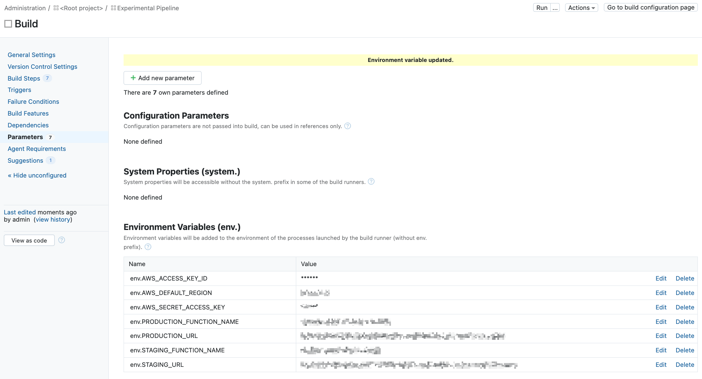

# 01_01 TeamCity
[TeamCity Professional](https://www.jetbrains.com/teamcity/) is a self-hosted, build management and continuous integration server from JetBrains, the company behind popular software development tools and the Kotlin programming language.

## Reccommended Resources
- [TeamCity On-Premises Documentation Home](https://www.jetbrains.com/help/teamcity/teamcity-documentation.html)
- [Learn TeamCity](https://www.jetbrains.com/teamcity/learn/)

## Prequisites
Having the following items in place before starting this lab will help you have a smooth experience.

1. A [GitHub account](https://github.com/join) is required to host the code for the sample application.
1. An [Amazon Web Services account](https://aws.amazon.com/free) is needed to deploy and host the Jenkins server and the sample application used for the deployment target.
1. The sample application should be in place before starting.  See [00_06 About the Exercise Files](../../ch0_introduction/00_06_about_the_exercise_files/README.md) for steps to deploy the sample application.

## Deploy the TeamCity server
### 1. Create an AWS CloudFormation Stack using the provided template
1. Log into your AWS account.  Select the search bar at the top of the page and enter **CloudFormation**.
1. On the CloudFormation homepage, select **Create stack**.  If the button includes a dropdown, select **With new resources (standard)**.
1. Under "Prerequisite - Prepare template", confirm that "Template is ready" is selected.
1. Under "Specify template", select **Upload a template file**.  Select **Chose file**.  Browse to the exercise files for this lesson on your local system.  Select [`teamcity-cloudformation-template.yml`](./teamcity-cloudformation-template.yml).  Select **Open**. Select **Next**.
1. Enter a name for the stack under "Stack name"; `teamcity` is a good choice. *Note that the name should only include letters (A-Z and a-z), numbers (0-9), and dashes (-)*.
1. Accept the defaults under "Parameters" and select **Next**.
1. On the "Configure stack options" screen, keep all options as the default.  Scroll to the bottom of the page and select **Next**.
1.  On the "Review" screen, scroll to the bottom of the page and select the **checkbox** next to "I acknowledge that AWS CloudFormation might create IAM resources with custom names".  Select **Submit**.
1. Review the "Events" tab on the stack homepage until *CREATE_COMPLETE* is reported under the "Status" column for the Logical ID that matches your stack name. *Note that it may take 5 to 10 minutes for the stack to report CREATE_COMPLETE*.
1.  On the stack homepage, select the "Outputs" column.  Open the value for the key "URL" in a new tab.

### 2. Configure the TeamCity server
1. On the TeamCity homepage, select **Proceed**.
2. On the "Database connection setup" page, next to "Select the database type", select **Internal (HSQLDB)**.  *Note that this option selects an embedded database which is for evaluation purposes and is not intended for production use*.  Select **Proceed**.
3. On the "License Agreement" page, scroll to the bottom of the page, select the checkbox next to **Accept license agreement**.  Select **Continue**.
4. On the "Create Administrator Account" page, select a username and password for your admin account and select **Create Account**.
5. At the top left of the TeamCity home page, select **Agents**.
6. In the menu on the left under "Overivew", select **Unathorized** to expose the two agents that were deployed with the server.
7. Select **agent-1**.  On the configuration page for agent-1, select **Authorize**.  Enter a comment for the authorization (perhaps, "Adding a new agent") and select **Authorize**.
8. Report the authorization steps for "agent-2".

## Implement the Experimental Pipeline
To implement the experimental pipeline in TeamCity, you will need to create a GitHub repo and add the exercise files.

Then you'll create the project that implements the pipeline.  After that, you'll attach a VCS root for the repo and update the project parameters.

And finally, you'll trigger the pipeline to deploy the sample applicaiton.

Before starting these steps, open the Output tab of the Clouformation stack for the sameple application. You'll be referencing values displayed on that tab.

### 1. Create a GitHub repo for the sample application code
Because this course covers multiple tools, a dedicated repo is need for each tool to prevent unexpected deployments to the sample-application.

1. Create a new GitHub repo. Give the repo a name and description.  Please select **Public** for the repo visibility to simplify access.  Select the option to add a README file and select **Python** when adding a `.gitignore` file.
1. From ther repo home page, select **Add file -> Upload files**.
1. Select **choose your files** and browse to the exercise files for this lesson on your local system.
1. Select all of the files and then select **Open**.
1. After the files have been uploaded, enter a commit message and select **Commit changes**.
1. TODO: Add steps for creating a `.teamcity` directory and relocating `pom.xml` and `settings.kts`.

### 2. Setup the pipeline
#### 2.1 Create the project, build configuration, and parameters
1. From the home page of your TeamCity server, select **New project...**.
2. Confirm "From a repository URL" is selected.  Next to "Repository URL:" enter the URL for your GitHub Repo. Find this value from the home page of your repo by selecting **Code -> HTTPS** and then selecting the stacked squares icon to copy the URL to your system's clipboard. Select **Proceed**.
3. On the "Create Project From URL" page, confirm that "Import settings from .teamcity/settings.kts" is selected.  For "Project name:" enter **Experimental Pipeline**.  Select **Proceed**.
4. On the "Experimental Pipeline" configuration page, under "Build Configurations", select **Build**.
5. From the menu on the left-hand side of the page, select **Parameters**.
6. For each of the values under "Environment Variables (env.)", select **Edit** and update the parameter with the corresponding value for your project.  *Note: Take care when copying values from the "Outputs" tab of the Cloudformation console as the values may contain tabs at the very end of the text.*

    After all 7 parameters are in place, your configuration should apprear as follows:

    

#### 2.2 Configure version control settings
1. From the "Build" configuration page of the "Experimental Pipeline" project, select **Version Control Settings**.
2. Select **Attach VCS root**.
3. Next to "Attach existing VCS root:", select the link for your GitHub repo under "Experimental Pipeline VCS roots".

### 3. Run the pipeline
1. At the top right of the page, select **Run**.
2. Select **Go to build configuration page** to see the build in progress.
3. Allow the build to complete.
4. If any errors are encountered, review the logs for errors and make corrections as needed.  Consider reviewing the configuration steps for the tasks and the values for the variables.  If you are not able to resolve the errors, please post a question on LinkinedIn Learning in the course Q&A section.
5. Open the URLs for the sample application's staging and production environments.  For both environments, confirm that the deployment platform is "TeamCity" and the build number matches the last successful build number.

## (OPTIONAL) Connect to a TeamCity Agent
TeamCity allows you to connect to the agents where your jobs will run.  This allows for debugging and exploration in the same environment used for building your projects.

1. At the top of the TeamCity home page, select **Agents**.
2. Select **agent-1** and then select **Open Terminal**.  This opens a new tab with a shell connected to the agent.

3. In the shell, run the following commands:

        bash
        whoami
        cd /opt/buildagent/work/
        ls

    This starts a bash shell which will provide more functionality than the default shell based on `sh`.  The session connects as the `buildagent` user.

    The `/opt/buildagent/work/` directory contains the sub-directories where your project steps are run.

    You can find the specific directory that corresponds to a build by checking the logs for "Checkout directory: /opt/buildagent/work/12345678abcdefg"

4. Change directories to one of the work sub-directories and activate the Python virtual environment.  Then, run the project script.

        cd /opt/buildagent/work/<your_directory_name here>
        python3 index_test.py
        python3 index.py

5. End the session by closing the tab.

