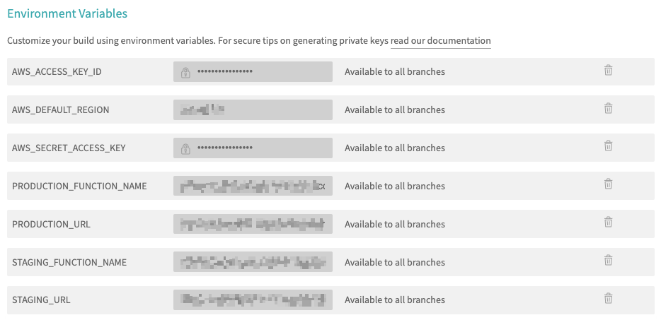

# 02_01 Travis CI
Travis CI is a continuous integration and deployment platform that automates software builds, tests, and deployments for projects hosted on GitHub. It helps developers maintain code quality and streamline collaboration by automatically triggering predefined actions upon code changes or pull requests.

## Recommended Resources
- [Travis CI Tutorial](https://docs.travis-ci.com/user/tutorial/)
- [Core Concepts for Beginners](https://docs.travis-ci.com/user/for-beginners/)
- [Language-specific Guides for Travis CI Configurations](https://docs.travis-ci.com/user/language-specific/)

## Prerequisites
Having the following items in place before starting this lab will help you have a smooth experience.

1. A [GitHub account](https://github.com/join) is required to host the code for the sample application. *NOTE: You need to be an admin for any repositories you want to integrate with Travis CI.*
2. A [Travis CI account](https://app.travis-ci.com/signup).
3. An [Amazon Web Services account](https://aws.amazon.com/free) is needed to deploy and host the sample application used for the deployment target.
4. The sample application should be in place before starting.  See [00_06 About the Exercise Files](../../ch0_introduction/00_06_about_the_exercise_files/README.md) for steps to deploy the sample application.
5. The exercise files for the course should be downloaded and accessible on your local system.

## Create a GitHub repo for the sample application code
Because this course covers multiple tools, a dedicated repo is need for each tool to prevent unexpected deployments to the sample-application.

1. Create a new GitHub repo. Give the repo a name and description.  Please select **Public** for the repo visibility to simplify access.  Select the option to add a README file and select **Python** when adding a `.gitignore` file.
2. From the repo home page, select **Add file -> Upload files**.
3. Select **choose your files** and browse to the exercise files for this lesson on your local system.
4. Select all of the files and then select **Open**.
5. After the files have been uploaded, enter a commit message and select **Commit changes**.

## Configure your Travis CI account, repo connection, and project parameters

### 1. Set up your Travis CI account
Follow the instructions provided by the [Travis CI Tutorial](https://docs.travis-ci.com/user/tutorial/) to set up your Travis CI account and connect it to GitHub.

*Note: Historically, Travis CI only supported repositories hosted in GitHub.  At the time this course was prepared, Travis CI includes Beta support for repositories hosted in Bitbucket, GitLab, and Assembla.  The content in this course is intended for repositories hosted in GitHub.*

*Note:  This error may occur upon account creation: "You exceeded the number of users allowed for your plan. Please switch to a bigger plan".  In the instructor's experience, the error lasted for about 5-10 minutes and was resolved without intervention.  More details can be found on this post in the Travis CI community forum: [Exceeded user count - unlimited?](https://travis-ci.community/t/exceeded-user-count-unlimited/10484/16).*

### 2. Repo connection and project parameters
After logging into your Travis CI account, open the [Github Apps Integration page](https://app.travis-ci.com/account/repositories).  Or select your account icon and then select **Settings -> Repositories**.

1. Select **Settings** next to the repository you are configuring to work with Travis CI.
2. Scroll down to the "Environment Variables" section.
3. Using the values from the "Outputs" tab of the Cloudformation stack for the sample application,  add the names and values for the following project parameters as environment variables.  For AWS_DEFAULT_REGION, function names, and function URLS, select "DISPLAY VALUE IN BUILD LOG"".

   - AWS_ACCESS_KEY_ID
   - AWS_DEFAULT_REGION
   - AWS_SECRET_ACCESS_KEY
   - PRODUCTION_FUNCTION_NAME
   - PRODUCTION_URL
   - STAGING_FUNCTION_NAME
   - STAGING_URL

   After all 7 parameters are in place, your configuration should appear as follows:

### Run the pipeline by creating the Travis configuration file
Travis will automatically trigger a new build for every change in the repository.  You'll trigger the first build by putting the Travis configuration in place.

1. In your GitHub repo, rename the file `travis.yml` to `.travis.yml`. *Note that the `.` at the beginning of the file will cause the file to become hidden on Linux and MacOS file systems.*  Commit the renamed file to the repo.
2. Open the [Travis dashboard](https://app.travis-ci.com/dashboard) and wait for the build to be triggered.  It may take about 1 minute.
3. Select the link under **"LAST BUILD"** when the build number changes and the build activity icon starts moving.
4. Select the **Job Log** tab to follow the build in real time.
5. Allow the build to complete.
6. If any errors are encountered, review the logs and make corrections as needed.  Consider reviewing the configuration steps for the parameters.  If you are not able to resolve the errors, please post a question on LinkedIn Learning in the course Q&A section.
7. Open the URLs for the sample application's staging and production environments.  For both environments, confirm that the deployment platform is "Travis CI" and the build number matches the last successful build number.

## Additional Information
- Beta support is in place for repos hosted in Bitbucket, GitLab, and Assembla
- Python versions don't include recent versions (ie, 3.11+)
  - Take a look at [Specifying Python versions](https://docs.travis-ci.com/user/languages/python/#specifying-python-versions)
  - From that webpage: *"3.6" current default Python on Travis CI*

[Next: 02_02 CircleCI](../02_02_circleci/README.md)
