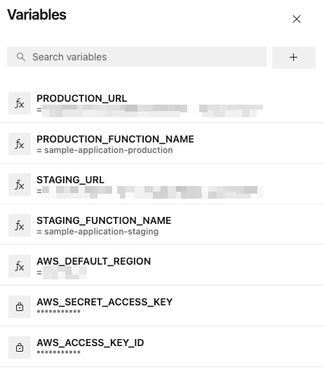

# 03_02 Azure Pipelines
Azure DevOps includes a complete set of hosted tools for application development with Pipelines as the main tool for building, testing, and deploying applications.

- [Azure Pipelines](https://azure.microsoft.com/en-us/products/devops/pipelines/)

## Recommended Resources
- [Azure DevOps for Beginners on LinkedIn Learning](https://www.linkedin.com/learning/azure-devops-for-beginners)

## Prerequisites
Having the following items in place before starting this lab will help you have a smooth experience.

1. An [Azure DevOps account](https://learn.microsoft.com/en-us/azure/devops/pipelines/get-started/pipelines-sign-up?view=azure-devops) is needed to host the code for this exercise and create the pipeline.  
    
    Follow the instructions on the linked page to create an account.

2. An [Amazon Web Services account](https://aws.amazon.com/free) is needed to deploy the sample application used for the deployment target.
3. The sample application should be in place before starting.  See [00_06 About the Exercise Files](../../ch0_introduction/00_06_about_the_exercise_files/README.md) for steps to deploy the sample application.
4. The exercise files for the course should be downloaded and accessible on your local system.

## Implement the Experimental Pipeline
To implement the experimental pipeline in Azure Pipelines, you will need to create an Azure DevOps project, add the exercise files, and modify the files for your project if needed.

Next, you'll configure the project that implements the pipeline.

And finally, you'll trigger the pipeline to deploy the sample application.

Before starting these steps, open the Output tab of the Cloudformation stack for the sample application.  You'll be referencing values displayed on that tab.

### 1. Create an Azure DevOps project for the repo and pipeline
For this exercise, we'll use the repo service included with an Azure DevOps project.

1. From the Azure DevOps homepage, select **+ New Project**.
2. Enter a project name and description.  Under "Visibility", select **Public**.  Select **Create**.
3. From the homepage of the new project, Select **Repos**.
4. At the bottom of the page, under "Initialize 
main branch with a README or gitignore", select the option to add a `README` and choose `Python` for the `.gitignore`.  Select **Initialize**.
1. On the new repo page, select the three-dot menu on the upper right and then select **Upload files**.
2. Select **Browse** and navigate to the location where you downloaded the files for thhis lesson.  Select all of the files  and then select **Open**.
3. Select **Commit**.

### 2. Configure and run the pipeline
1. Select **Set Up Build**
1. Select **Sariables** -> **New variable**
1. Add the name and value for each of the following parameters. Select the "+" for each additional varaible.  *Note: For AWS_ACCESS_KEY_ID and AWS_SECRET_ACCESS_KEY select the option for "Keep this value secret".*
   
     -   AWS_ACCESS_KEY_ID
     -   AWS_SECRET_ACCESS_KEY
     -   AWS_DEFAULT_REGION
     -   STAGING_FUNCTION_NAME
     -   STAGING_URL
     -   PRODUCTION_FUNCTION_NAME
     -   PRODUCTION_URL

    Your completed variable configuration should appear similar to the following:
    

    When all variables are in place select **Save**.

1. Run the pipeline by selecting **Run**.
1. Allow the build to complete.
1. Open the URLs for the sample application's staging and production environments.  For both environments, confirm that the deployment platform is "Azure DevOps" and the build number matches the last successful pipeline number.
1. If any errors are encountered, review the logs and make corrections as needed.  Consider reviewing the configuration steps for the parameters.  If you are not able to resolve the errors, please post a question on LinkinedIn Learning in the course Q&A section.

## Additional Information
- [Specify jobs in your pipeline](https://learn.microsoft.com/en-us/azure/devops/pipelines/process/phases)
- [Pricing for Azure DevOps](https://azure.microsoft.com/en-us/pricing/details/devops/azure-devops-services/)

