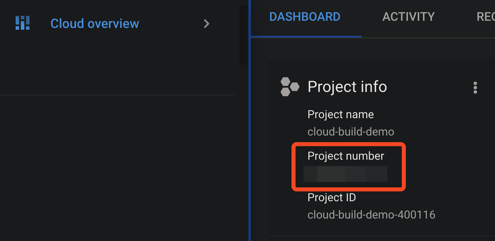
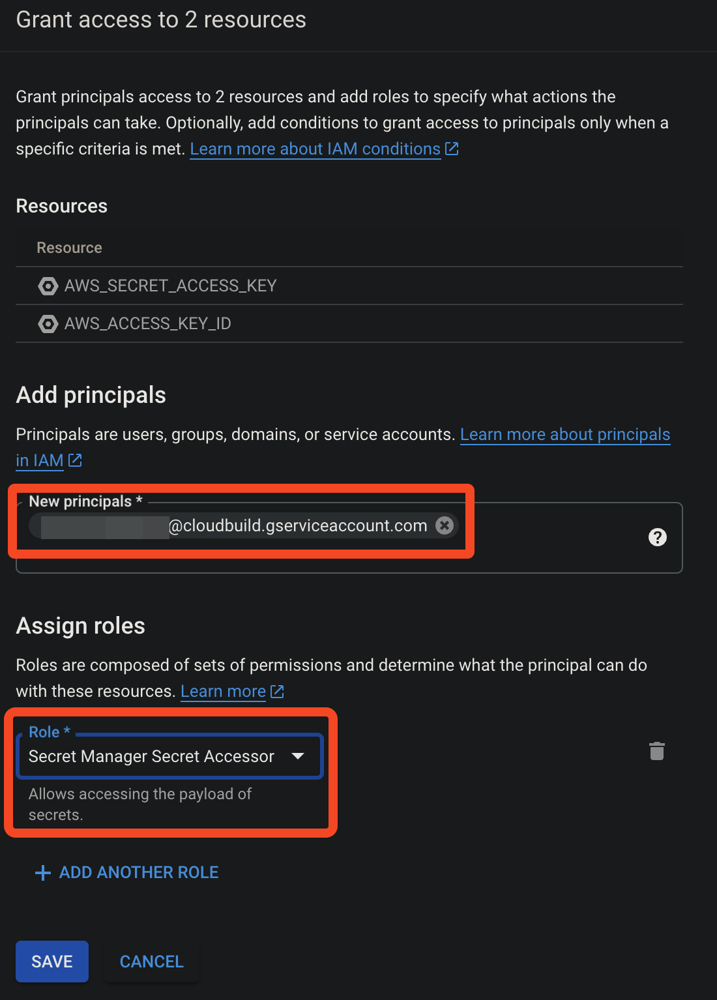

# 03_03 GCP Cloud Build
[Cloud Build](https://cloud.google.com/build) is an automation service from the Google Cloud Platform suite of tools.

## Recommended Resources
- [Cloud Build](https://cloud.google.com/build)
- [Substituting variable values](https://cloud.google.com/build/docs/configuring-builds/substitute-variable-values)
- [Using user-defined variable substitutions](https://cloud.google.com/build/docs/configuring-builds/substitute-variable-values#using_user-defined_substitutions)
- [Google Cloud Build official builder images](https://github.com/GoogleCloudPlatform/cloud-builders#google-cloud-build-official-builder-images)


## Prerequisites
Having the following items in place before starting this lab will help you have a smooth experience.

1. A [Google Cloud Platform account](https://cloud.google.com/) is required to implement the pipeline.
2. A [GitHub account](https://github.com/join) is required to host the code for the sample application.
3. An [Amazon Web Services account](https://aws.amazon.com/free) is needed to deploy the sample application used for the deployment target.
4. The sample application should be in place before starting.  See [00_06 About the Exercise Files](../../ch0_introduction/00_06_about_the_exercise_files/README.md) for steps to deploy the sample application.
5. The exercise files for the course should be downloaded and accessible on your local system.

## Implement the Experimental Pipeline
To implement the experimental pipeline in Cloud Build, you will need to create a GitHub repo, add the exercise files, and modify the files for your project if needed.

Next, you'll create the project that implements the pipeline.

And finally, you'll trigger the pipeline to deploy the sample application.

Before starting these steps, open the Output tab of the Cloudformation stack for the sample application.  You'll be referencing values displayed on that tab.

### 1. Create a GitHub repo for the sample application code
Because this course covers multiple tools, a dedicated repo is need for each tool to prevent unexpected deployments to the sample-application.

#### 1.1 Create a repo and upload the exercise files for this lesson
1. Create a new GitHub repo. Give the repo a name and description.  Please select **Public** for the repo visibility to simplify access.  Select the option to add a README file and select **Python** when adding a `.gitignore` file.
2. From the repo home page, select **Add file -> Upload files**.
3. Select **choose your files** and browse to the exercise files for this lesson on your local system.
4. Select all of the files and then select **Open**.

#### 1.2 Create a repo and upload the exercise files for this lesson
1. After the files have been uploaded, enter a commit message and select **Commit changes**.
2. Locate and edit the file `cloudbuild.yaml`.  Locate the `substitutions` section and update the following values the corresponding value from the Output tab of the sample application Cloudformation stack:

    ```
    substitutions:
      _AWS_DEFAULT_REGION: UPDATE_THIS_VALUE
      _STAGING_FUNCTION_NAME: UPDATE_THIS_VALUE
      _STAGING_URL: UPDATE_THIS_VALUE
      _PRODUCTION_FUNCTION_NAME: UPDATE_THIS_VALUE
      _PRODUCTION_URL: UPDATE_THIS_VALUE
    ```

    After updating the values, commit the changes.

### 2. Create a GCP Project and Add Secrets
1. Create a new GCP project and confirm that the project is the currently active project for your session.  If needed, enable billing.
2. Make a note of the **Project number** from the Project info panel.  You'll need this value later.

    

3. In the GCP search bar, search for and select **Secret Manager**.
4. If needed, select **ENABLE** under "Secret Manager API".
5. On the Secret Manager home page, select **CREATE SECRET**.
6. For "Name", enter `AWS_ACCESS_KEY_ID`.  For "Secret Value", enter the value for the AWS Access Key ID from the Output tab of the sample application Cloudformation stack.  Select **Create Secret**.
7. Select the arrow to go back to the parent page.
8. Select **CREATE SECRET**.  Repeat the secret creation step for `AWS_SECRET_ACCESS_KEY`.  Be sure to check for any spaces or tabs at the end of the secret as you copy and paste from the CloudFormation output into the Secret Value field.
9.  Select the arrow to go back to the parent page.
10. On the Secret Manager home page, select the checkbox next to both secret names.
11. On the permissions panel, select **ADD PRINCIPAL**.
12. In the New principals textbox, enter the email address of your Cloud Build service account using the form `PROJECT_NUMBER@cloudbuild.gserviceaccount.com` where PROJECT_NUMBER is the value noted in step 2.  If needed, you can find the project number in your Project settings page: select three dots at top right of page, select project settings, locate project number.
13. Under "Assign Roles", select **Secret Manager Secret Accessor**.  Select **Save**.

    

### 3. Configure Cloud Build and Create a Cloud Build trigger
1. In the GCP search bar, search for and select **Cloud Build**.
2. If needed, select **ENABLE** under "Cloud Build API".
3. After the API is enabled, select **Cloud Build -> Dashboard**.  Select **SET UP BUILD TRIGGERS**.
4. Enter a name and optional description for the trigger.  Perhaps `sample-application-trigger` for the name.
5. Under "Event", select **Push to a branch**.
6. Under "Source", confirm "1st Gen" is selected. In the "Repository" field, select **CONNECT NEW REPOSITORY**.
7. Under "Select source code management provider", confirm **GitHub (Cloud Build GitHub App)** is selected and select **Continue**.
8.  Authenticate with GitHub if needed.  Authorize and install **Google Cloud Build**.
9.  Select your username or organization and select **Only select repositories**.  Select the repo you created in step 1.  Select **Install**.
10. Back in the GCP UI, select the repo you just installed.  Confirm permissions for GitHub and select **Connect**.
11. Under "Configuration", confirm "Autodetected" is selected for "Type" and under "Location", confirm "Repository" is selected.  Then select **CREATE**.
12. Next to the trigger you just created, select **RUN** -> **RUN TRIGGER**.
13. Allow the build to complete.
14. Open the URLs for the sample application's staging and production environments.  For both environments, confirm that the deployment platform is "Google Cloud Build" and the build number matches the last successful build number.
15. If any errors are encountered, review the logs and make corrections as needed.  Consider reviewing the configuration steps for the parameters.  If you are not able to resolve the errors, please post a question on LinkedIn Learning in the course Q&A section.

[Next: 03_04 Cloud Service Provider Tool Summary](../03_04_cloud_service_provider_tool_summary/README.md)
