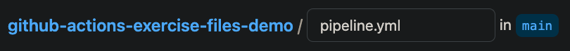
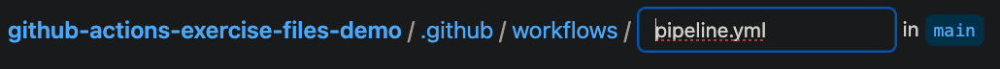

# 04_01 GitHub Actions
GitHub Actions is a CI/CD tool that is built into GitHub.

## Recommended Resources
- [GitHub Actions Documentation](https://docs.github.com/en/actions): The official documentation for GitHub Actions.
- [GitHub Actions Variables](https://docs.github.com/en/actions/learn-github-actions/variables)
- [About billing for GitHub Actions](https://docs.github.com/en/billing/managing-billing-for-github-actions/about-billing-for-github-actions)

## Prerequisites
Having the following items in place before starting this lab will help you have a smooth experience.

1. A GitHub account is required to host the code for the sample application.
2. An Amazon Web Services account is needed to deploy the sample application used for the deployment target.
3. The sample application should be in place before starting. See [00_06 About the Exercise Files](../../ch0_introduction/00_06_about_the_exercise_files/README.md) for steps to deploy the sample application.
4. The exercise files for the course should be downloaded and accessible on your local system.

## Implement the Experimental Pipeline
To implement the experimental pipeline in GitHub Actions, you will need to create a GitHub repo, add the exercise files, and configure the repository settings.

Before starting these steps, open the Output tab of the Cloudformation stack for the sample application. You'll be referencing values displayed on that tab.

### 1. Create a GitHub repo for the sample application code
Because this course covers multiple tools, a dedicated repo is need for each tool to prevent unexpected deployments to the sample-application.

1. Create a new GitHub repo. Give the repo a name and description. Please select **Public** for the repo visibility to simplify access. Select the option to add a README file and select **Python** when adding a `.gitignore` file.
2. From the repo home page, select **Add file -> Upload files**.
3. Select **choose your files** and browse to the exercise files for this lesson on your local system.
4. Select all of the files and then select **Open**.
5. After the files have been uploaded, enter a commit message and select **Commit changes**.

### 2. Configure Environments and Secrets
GitHub Actions uses environments and secrets to store values that are used in the pipeline.  In this step, you'll create the environments and secrets needed for the pipeline.

1. From the repo home page, select **Settings**.
2. Select **Environments**.
3. Select **New environment**.
4. For "Environment name", enter **Staging** and select **Configure environment**.
5. Under "Environment variables", select **Add variable**.
6. For "Name", enter **FUNCTION_NAME**.  For "Value", enter the value for the function name from the Cloudformation stack output.
7. Select **Add variable**.
8. For "Name", enter **URL**.  For "Value", enter the value for the URL from the Cloudformation stack output.
9. Select **Create environment**.
10. Repeat steps 3-8 to create the Production environment.  Use **Production** for the environment name and the corresponding values from the Cloudformation stack output for the production function name and URL.
11. From the settings menu, select **"Secrets and variables"** -> **Actions**.
12. Select **"New repository secret"**.
13. For name, enter **AWS_SECRET_ACCESS_KEY**. For "Value", enter the value for the URL from the Cloudformation stack output.  Select **Add secret**.
14. Repeat the process to add a secret for **AWS_ACCESS_KEY_ID**.
15. Select the "Variables" tab.  Select **"New repository variable"**.
16. For name, enter **AWS_DEFAULT_REGION**. For "Value", and the corresponding value for your project from the Cloudformation stack output.  Select **Add variable**.

### 3. Move the workflow file into the `.github/workflows` directory to trigger the pipeline
The workflow file is the file that defines the pipeline.  In this step, you'll move the workflow file into the `.github/workflows` directory.

1. From the repo home page, select `pipeline.yml`.
1. Edit the file in place by selecting the pencil icon or by typing `e`.
1. Update the location of the workflow file by adding `.github/workflows/` to the beginning of the file name.

    Before:
    

    After:
    

1. Select **Commit changes** -> **Commit changes**.
1. Select **Actions** from the repo home page.  You should see the workflow running.
1. Select the actively running workflow to follow the pipeline's progress. Wait for the pipeline to complete.
1. Open the URLs for the sample application's staging and production environments. For both environments, confirm that the deployment platform is "GitHub Actions" and the build number matches the last successful build number.
1. If any errors are encountered, review the logs and make corrections as needed. Consider reviewing the configuration steps for the environment variables and the repository secrets. If you are not able to resolve the errors, please post a question on LinkedIn Learning in the course Q&A section.

[Next: 04_02 GitLab CI](../04_02_gitlab_ci/README.md)
