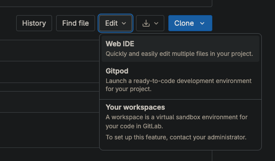
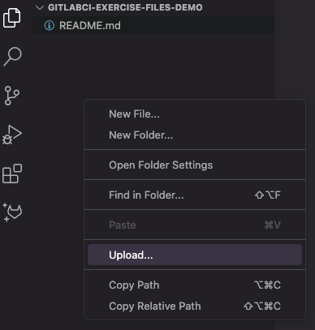
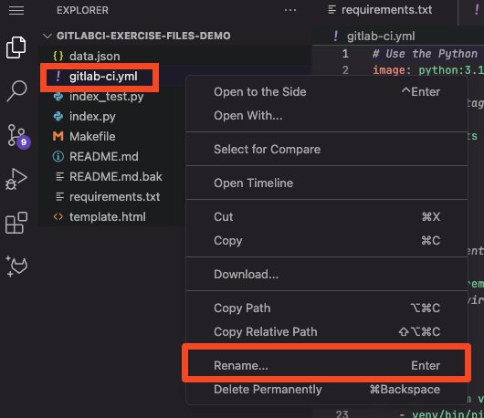
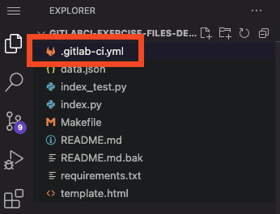
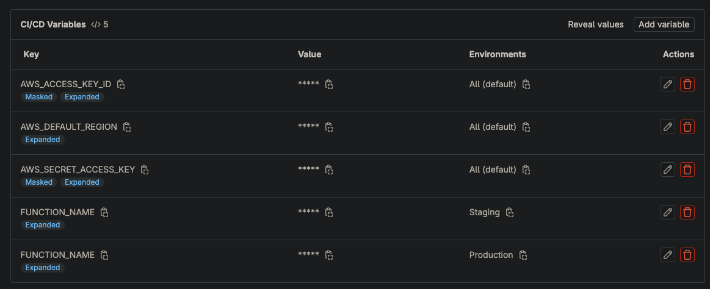
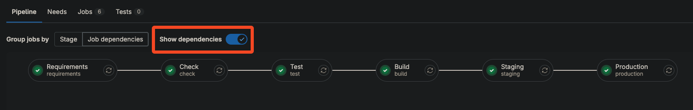

# 04_02 GitLab CI
GitLab CI is a CI/CD tool that is built into GitLab.

## Recommended Resources
- [Get started with GitLab CI/CD](https://docs.gitlab.com/ee/ci/index.html): The official documentation for GitLab CI/CD.
- [GitLab CI/CD Variables](https://docs.gitlab.com/ee/ci/variables/)
- [GitLab CI/CD Environments and deployments](https://docs.gitlab.com/ee/ci/environments/)
- [GitLab CI/CD Pipelines](https://docs.gitlab.com/ee/ci/pipelines/)

## Prerequisites
Having the following items in place before starting this lab will help you have a smooth experience.

1. A [GitLab account](https://gitlab.com/users/sign_up) is required to host the code for the sample application.
2. An [Amazon Web Services account](https://aws.amazon.com/free/) is needed to deploy the sample application used for the deployment target.
3. The sample application should be in place before starting. See [00_06 About the Exercise Files](../../ch0_introduction/00_06_about_the_exercise_files/README.md) for steps to deploy the sample application.
4. The exercise files for the course should be downloaded and accessible on your local system.

## Implement the Experimental Pipeline
To implement the experimental pipeline in GitLab CI, you will need to create a GitLab project, add the exercise files, and configure the pipeline settings.

Before starting these steps, open the Output tab of the Cloudformation stack for the sample application. You'll be referencing values displayed on that tab.

### 1. Create a GitLab Project and Add the Exercise Files
1. Log in to your GitLab account.
2. Select **New project**. Select **Create blank project**.
3. Enter a project name. Select **Create project**.
4. From the side menu, select **Code** -> **Repository**.
5. Open the Web IDE by **typing `.`** or, from the top, right-hand side of the repository view, select **Edit** -> **Web IDE**.

    

6. Right click in the file explorer and select **Upload...**.

    

7. Browse to the `ch4_code_repositories/04_02_gitlab_ci` directory on your local system. Select all files and select **Open**.
8. If you're prompted to replace the `README.md file, select **Replace**.
9.  Right click `gitlab-ci.yml` and select **Rename...**.

    

10. Add a `.` at the beginning of the file name. `gitlab-ci.yml` should now be `.gitlab-ci.yml`.

    

11. Select the Git icon with the badge showing the number of files added. Enter a commit message and select **Commit to 'main'**.  If prompted, confirm committing files to the default branch.
12. Go back to the **Repository** tab in your browser.

### 2. Update the Environment URLs
1. From the sidebar menu, select **Operate** -> **Environments**.
1. Select the **Production** environment. Select **Edit**.
2. Under **External URL**, enter the URL for the production environment. This is the value for the `ProductionURL` output from the Cloudformation stack for the sample application.  Select **Save**.
3. Repeat the steps for the **Staging** environment, adding the `StagingURL` value from the Cloudformation stack as the value for the **External URL**.

### 3. Add the Project Parameters
1. From the sidebar menu, select **Settings** -> **CI/CD**.
2. Next to **Variables**, select **Expand**.
3. Select **Add variable**.
4. Under "Environment", select **Production**.  Under "Flags", uncheck **Protect variable**. Under "Key", enter **`FUNCTION_NAME`**.  Under "Value", enter the value for the `ProductionFunctionName` output from the sample application Cloudformation stack.  Select **Add variable**.
5. Repeat the steps to add a **`FUNCTION_NAME`** for the **Staging** environment, using the `StagingFunctionName` value from the Cloudformation stack output.
6. Next, add the AWS Credentials, starting with `AWS_DEFAULT_REGION`.  Select **Add variable**.  Under "Environments", confirm that **"All (default)"** is selected.  Uncheck **Protect variable**.  Under "Key", enter **`AWS_DEFAULT_REGION`**.  Under "Value", enter the value for the `AwsDefaultRegion` output from the sample application Cloudformation stack.  Select **Add variable**.
7. Now create variables for **`AWS_SECRET_ACCESS_KEY`** and **`AWS_ACCESS_KEY_ID`**.  Repeat the following for each these variables:
   1. Confirm that **"All (default)"** is selected under "Environments.  
   2. Uncheck **Protect variable**.
   3. Check **Mask variable**.
   4. For the key, enter **`AWS_SECRET_ACCESS_KEY`** or **`AWS_ACCESS_KEY_ID`**.
   5. for **"Value"** enter the values for the `AwsSecretAccessKey` or `AwsAccessKeyId` outputs from the sample application Cloudformation stack.
   6.  Select **Add variable**.

  

### 4. Run the Pipeline
1. From the sidebar menu, select **Build** -> **Pipelines**.
2. Select **Run pipeline** -> **Run pipeline**.
3. On the pipeline view, select **Show dependencies** to see the connections between the pipeline jobs.
4. Wait for the pipeline to complete. 

    

5. Open the URLs for the sample application's staging and production environments. For both environments, confirm that the deployment platform is "**GitLab CI**" and the build number matches the last successful pipeline number.
6. If any errors are encountered, review the logs and make corrections as needed. Consider reviewing the configuration steps for the environment variables and the repository secrets. If you are not able to resolve the errors, please post a question on LinkedIn Learning in the course Q&A section.
