# 04_03 Bitbucket Pipelines
Bitbucket Pipelines is a continuous integration and continuous delivery (CI/CD) service built into Bitbucket.

## Recommended Resources
- [Build, test, and deploy with Pipelines](https://support.atlassian.com/bitbucket-cloud/docs/build-test-and-deploy-with-pipelines/): The official Bitbucket Pipelines documentation.
- [Bitbucket Pipelines configuration reference](https://support.atlassian.com/bitbucket-cloud/docs/bitbucket-pipelines-configuration-reference/)
- [Set up and monitor Bitbucket Deployments](https://support.atlassian.com/bitbucket-cloud/docs/set-up-and-monitor-bitbucket-deployments/)
- [Clone a Git repository](https://support.atlassian.com/bitbucket-cloud/docs/clone-a-git-repository/)
- [Configure SSH and two-step verification](https://support.atlassian.com/bitbucket-cloud/docs/configure-ssh-and-two-step-verification/)

## Prerequisites
Having the following items in place before starting this lab will help you have a smooth experience.

1. [Atlassian and Bitbucket accounts](https://bitbucket.org/product) are required to host the code for the sample application.
2. An [Amazon Web Services account](https://aws.amazon.com/free/) is needed to deploy the sample application used for the deployment target.
3. The sample application should be in place before starting. See [00_06 About the Exercise Files](../../ch0_introduction/00_06_about_the_exercise_files/README.md) for steps to deploy the sample application.
4. The exercise files for the course should be downloaded and accessible on your local system.

## Implement the Experimental Pipeline
To implement the experimental pipeline in Bitbucket Pipelines, you will need to create a Bitbucket repo, add the exercise files, and configure the pipeline settings.

Before starting these steps, open the Output tab of the Cloudformation stack for the sample application. You'll be referencing values displayed on that tab.

### 1. Create a Bitbucket Repository
1. Log into your Bitbucket account and select the **Repositories** tab.  Then select **Create repository**.
1. Next to "Project name" select **"Select project"** and choose "**Create new project"**.  Enter a name for the project.
2. Next to **"Repository name"**, enter a name for the repo.
3. Determine the desired access level and select or deselect the checkbox next to **"Private repository"**.
4. For **"Default branch name"**, enter **`main`**.
5. For **"Include .gitignore?"**, confirm that **"Yes (recommended)"** is selected.
6. Expand the "Advanced settings" menu and next to "Language", select **Python**.
7. Select "Create repository"

### 2. Add the Exercise Files
To add the exercise files to your Bitbucket repo, you'll need to clone the remote repo to your local system, copy the files into the local repo, and then commit and push the files to the remote repo.

#### 2.1 Clone the Remote Repo to Your Local System
To use an SSH key for cloning, follow these links to set up an SSH key and clone the repo:
   - [Clone a Git repository](https://support.atlassian.com/bitbucket-cloud/docs/clone-a-git-repository/)
   - [Configure SSH and two-step verification](https://support.atlassian.com/bitbucket-cloud/docs/configure-ssh-and-two-step-verification/)

Otherwise, follow these steps to [create a Repository Access Token](https://support.atlassian.com/bitbucket-cloud/docs/create-a-repository-access-token/) that can be used to clone and push changes to the repo:

1. From the repo home page, select **Repository settings**.

    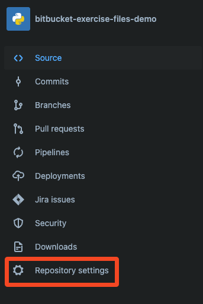

1. Under "Security", select **Access tokens**.

    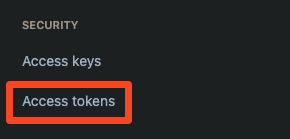

1. Select **Create Repository Access Token**.

    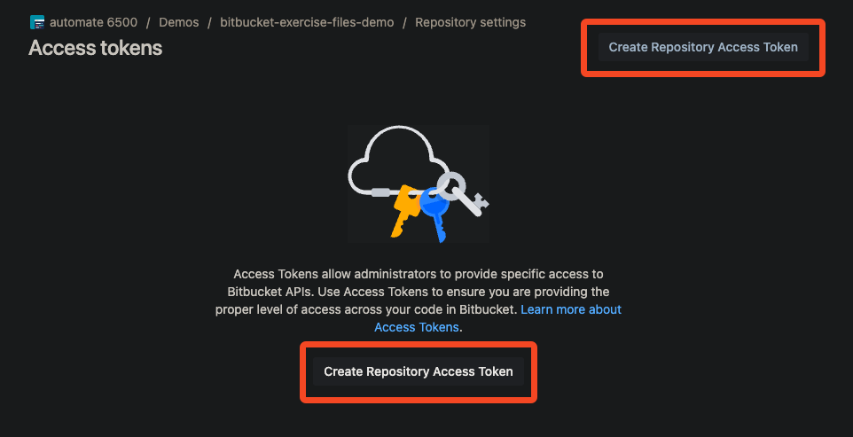

1. Enter a label for the token.  Under "Repositories", select permissions for "Write".  Then select **Create**.

    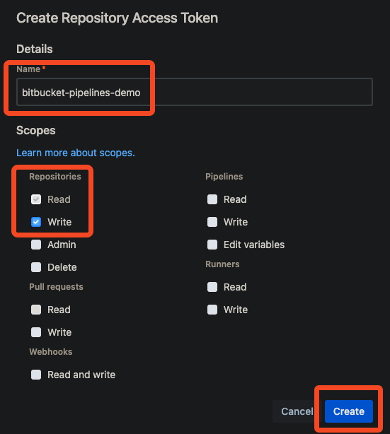


1. On the dialog for "Repository Access Token created", select the stacked-squares icon to copy the prepopulated clone command.

    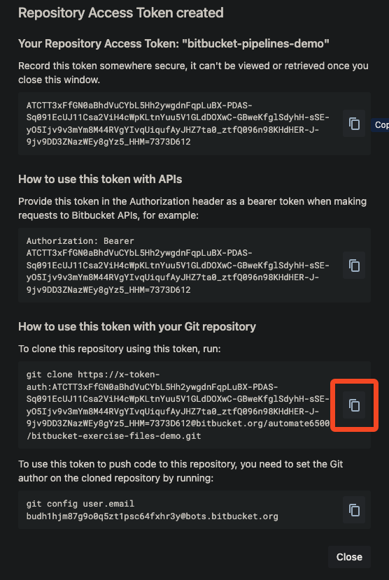

1. In a terminal, paste and run the clone command.

    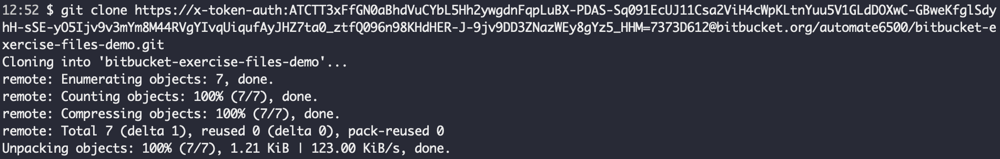

1. Back in the web UI, select the stacked-squares icon to copy the `git config` command to update the `user.email` setting for the repo.

    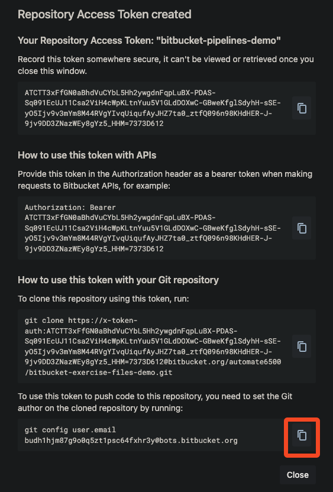

1. In a terminal, paste and run the `git config` command.

    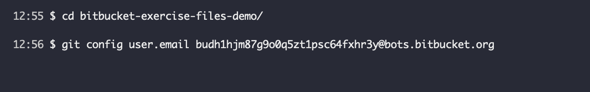

#### 2.2 Copy the Exercise Files to the Local Repo and Push Changes to the Remote Repo
Once you have the repo cloned to your local system, copy the files into the local repo, commit the changes, and push the changes to the remote repo.

1. Copy the exercise files into the local repo. You may use your system's file explorer or use a command line for this step.  Using the command line, the command would be similar to the following:

    ```bash
    cp -r <path-to-exercise-files>/* <path-to-local-repo>
    ```

2. Commit the changes to the local repo.

    ```bash
    git add .
    git commit -m "Adding exercise files"
    ```

3. Push the changes to the remote repo.

    ```bash
        git push
    ```

4. In the web UI, select **Source** to view the files in the repo.

### 3. Configure Pipeline Settings and Add Project Parameters
With the files in place, you need to configure the pipeline settings and add project parameters before running the pipeline.

1. In the web UI, select **Repository settings**.  Under "Pipeline", select **Settings**.
2. Toggle the switch next to **"Enable Pipelines"**.

    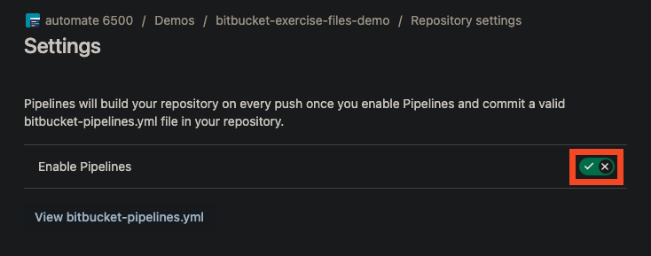

3. Select **Repository variables**.
4. Using the values from the Cloudformation output, Enter the name and value for each of the following project parameters.  Uncheck the **Secured** option for all variables except `AWS_ACCESS_KEY_ID` and `AWS_SECRET_ACCESS_KEY`.

        STAGING_FUNCTION_NAME
        STAGING_URL
        PRODUCTION_FUNCTION_NAME
        PRODUCTION_URL
        AWS_ACCESS_KEY_ID
        AWS_SECRET_ACCESS_KEY
        AWS_DEFAULT_REGION

    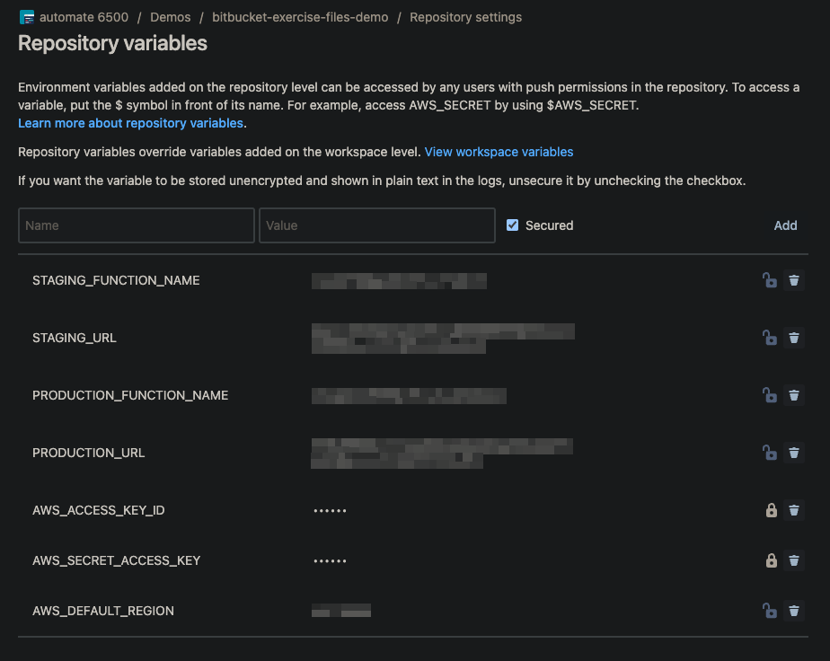


### 4. Run the Pipeline
Once the pipeline settings are configured, you can run the pipeline.

1. In the web UI, select **Pipelines**.
2. Select **Run initial pipeline**.
3. Select the `main` branch and the `default` pipeline.  Then select **Run pipeline**.

    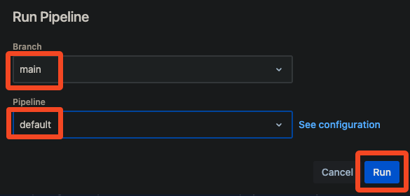

4. Wait for the pipeline to complete.

    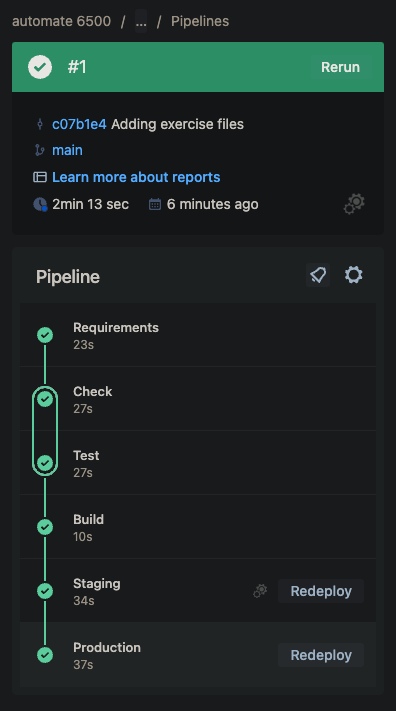

5. Open the URLs for the sample application's staging and production environments. For both environments, confirm that the deployment platform is "**Bitbucket Pipelines**" and the build number matches the last successful pipeline number.
6. If any errors are encountered, review the logs and make corrections as needed. Consider reviewing the configuration steps for the repository secrets. If you are not able to resolve the errors, please post a question on LinkedIn Learning in the course Q&A section.

[Next: 04_04 Code Repository Tool Summary](../04_04_code_repository_tool_summary/README.md)
