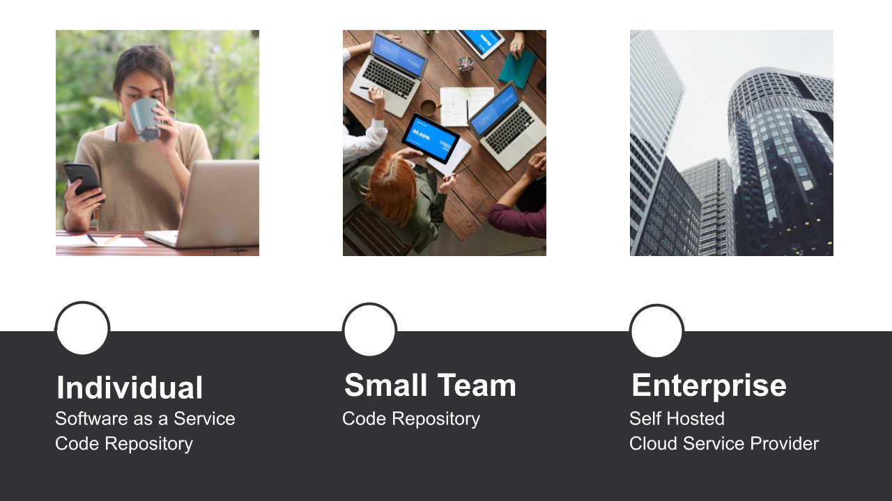

05_01 Selecting the Right CI Tool
This summary provides an overview of the CI/CD tool categories and guidance on choosing the right tool based on individual, team, or enterprise needs.

## Tool Categories
Start by considering tools from four categories:

- **Self-Hosted Tools:**
  - Requires installation and maintenance efforts.
  - Offers the most flexibility of all tools.

- **Software as a Service (SaaS) Tools:**
  - Easy onboarding modern features without installation or maintenance.

- **Cloud Service Providers:**
  - Provide integrations with cloud-based products and services, offering convenience.

- **Code Repositories:**
  - Simplifies collaboration by managing CI/CD and code on the same platform.

## Selecting CI Tools for Individuals, Teams, and Enterprises

  - **Individual developers** may prefer SaaS or code repository tools for quick setup.
  - **Small teams** looking for scalability and project management capabilities may opt for code repository tools.
  - **Businesses and enterprises** have flexibility to choose from any tool category but may benefit from self-hosted and cloud service provider options for integration and security.

## Experiment with Tools and Be Open to Change
  - Start with a tool that suits your current needs.
  - Be open to trying different tools if it doesn't fit your requirements.
  - Utilize the exercise files and revisit the course during your CI/CD tool selection journey.

Selecting the right CI/CD tool depends on your specific needs and context. Explore, experiment, and adapt as necessary to find the tool that works best for you.
